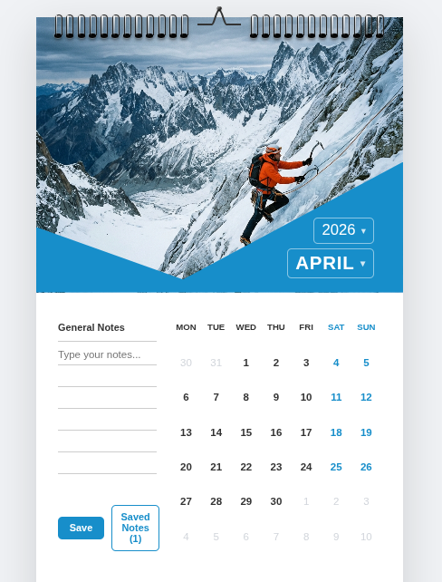

# 🗓️ Wall Calendar Component

A beautifully crafted, interactive wall calendar built with React — designed to feel like a physical calendar hanging on your wall.



---

## ✨ Features

### Core
- **Wall Calendar Aesthetic** — Spiral binding detail, hero image header, blue geometric overlay, and a ruled notepad — all evoking a real physical calendar
- **Date Range Selector** — Click any date to set a start; click another to define the end. Clear visual states for start, end, and in-between days
- **Integrated Notes** — Attach notes to a selected date range (or leave them as general memos). Notes are listed with their target dates
- **Fully Responsive** — Side-by-side desktop layout gracefully collapses to a stacked mobile layout

### Extras
- **Custom Dropdown Pickers** — Styled month and year selectors that stay in sync with the calendar grid, supporting navigation from 1950 to 2100
- **Saved Notes Modal** — All saved notes are persisted via `localStorage` and viewable in a modal, complete with delete functionality
- **Ruled Notepad Texture** — The notes textarea mimics lined paper using a CSS repeating gradient
- **Spiral Coil Binding** — Pure CSS rendered spiral rings across the top of the calendar for authentic wall-calendar feel
- **Weekend Highlighting** — Saturdays and Sundays are visually differentiated in both the weekday headers and date cells

---

## 🛠️ Tech Stack

- **React** (functional components + hooks)
- **Plain CSS** (no CSS frameworks — all custom)
- **localStorage** for client-side note persistence

---

## 🚀 Getting Started

### Prerequisites

- Node.js `>=16`
- npm or yarn

### Installation

```bash
git clone https://github.com/AppaniPrajwal/WallCalender.git
cd WallCalender
npm install
```

### Running Locally

```bash
npm run dev
```

Open [http://localhost:5173](http://localhost:5173) in your browser.

### Building for Production

```bash
npm run build
```

---

## 📁 Project Structure

```
WallCalender/
├── public/                 # Static assets served directly
├── src/
│   ├── assets/             # Images and static assets used in components
│   ├── App.css             # All styles (calendar, grid, notes, modal, responsive)
│   ├── App.jsx             # Main calendar component + CustomDropdown
│   ├── index.css           # Global base styles
│   └── main.jsx            # React entry point
├── .gitignore
├── eslint.config.js
├── index.html              # Vite HTML entry point
├── package.json
├── package-lock.json
├── README.md
└── vite.config.js          # Vite configuration
```

---

## 🎨 Design Decisions

| Decision | Rationale |
|---|---|
| Custom dropdowns for month/year | Native `<select>` elements can't be styled consistently across browsers; a custom solution matches the calendar's white-on-blue aesthetic |
| CSS-only spiral coils | Avoids SVG/image overhead; the `::before` and `::after` pseudo-elements handle the 3D highlight and punched-hole effect |
| `localStorage` for persistence | Keeps the project strictly frontend as required — no backend needed |
| `clip-path` blue shape | Replicates the angled geometric overlay from the design inspiration cleanly without extra DOM elements |
| Ruled textarea background | A `repeating-linear-gradient` on the textarea creates lined paper feel with zero extra markup |
| Range selection via string comparison | ISO date strings (`YYYY-MM-DD`) compare correctly with `<` / `>` operators, making range logic clean and dependency-free |

---

## 📱 Responsive Behaviour

| Breakpoint | Layout |
|---|---|
| `> 768px` | Notes panel left (35%) + calendar grid right (65%), side by side |
| `≤ 768px` | Calendar grid stacks on top, notes panel below; header image reduces in height |

---

## 📝 Usage

1. **Navigate months** using the month and year dropdowns in the header
2. **Select a date range** by clicking a start date, then an end date on the calendar grid
3. **Write a note** in the lined notepad area on the left
4. **Save** — the note is tagged with your selected date range (or marked "General Note")
5. **View all notes** via the "Saved Notes" button; delete any note individually

---

## 📄 License

MIT — free to use and adapt.
